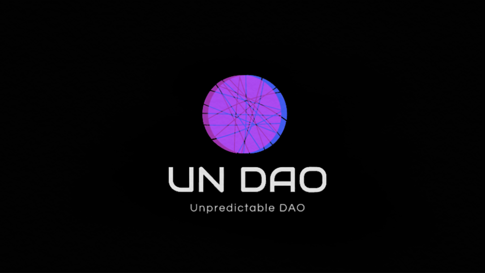

<div align="center">
	<br/>
	
	<br/>
</div>

## For developers using Unpredictable DAO's random number generator

Sample contracts are available here: https://github.com/unpredictabledao/unpredictabledao/tree/main/examples


## For developers who are interested in the protocol

### Dependencies

* npm
* node.js

### Setup

1. Clone this repository.

2. Install the required packages:
```
npm install
```

3. Edit your private key and make necessary setup in `hardhat.config.js`.

### Compile

```
npx hardhat compile
```

### Deploy

```
npx hardhat run --network localhost scripts/deploy.js
```

### Test

```
npx hardhat test
```


## For DAO participants

You can run a bot to particpate automatically (addressed here: https://github.com/undao/undao/blob/main/auto-participate.md).
